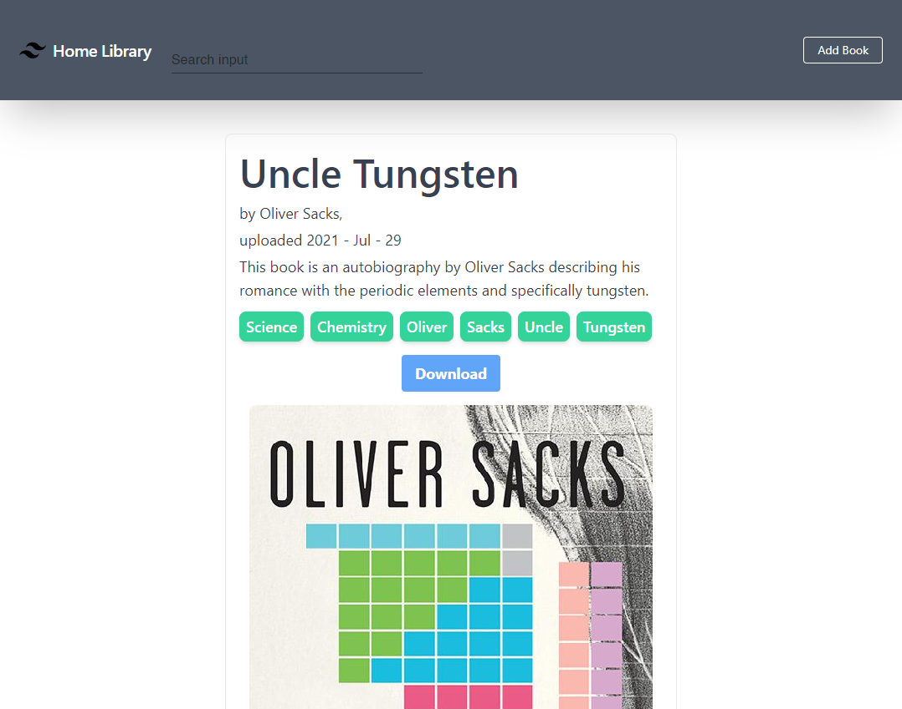
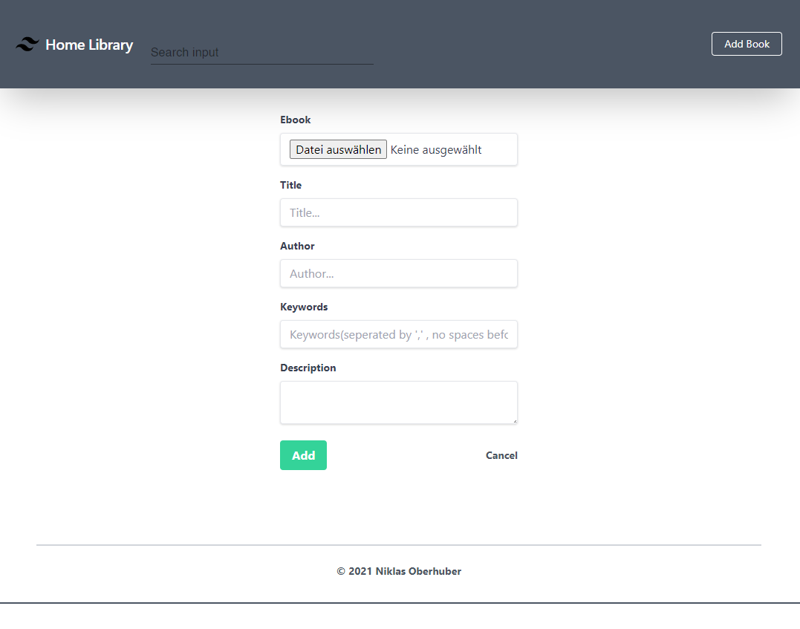
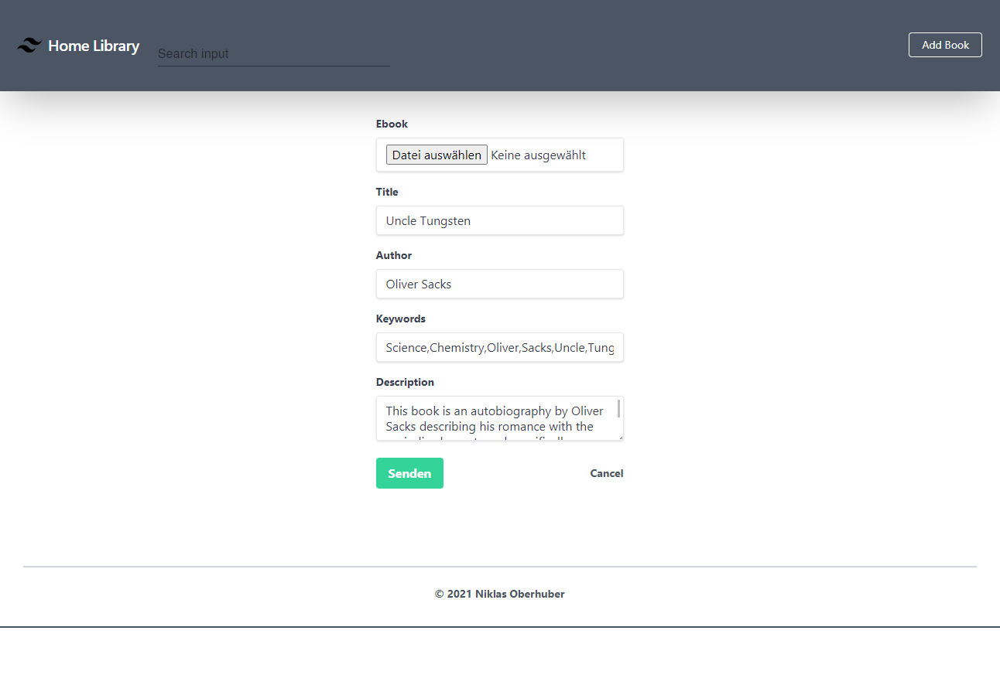
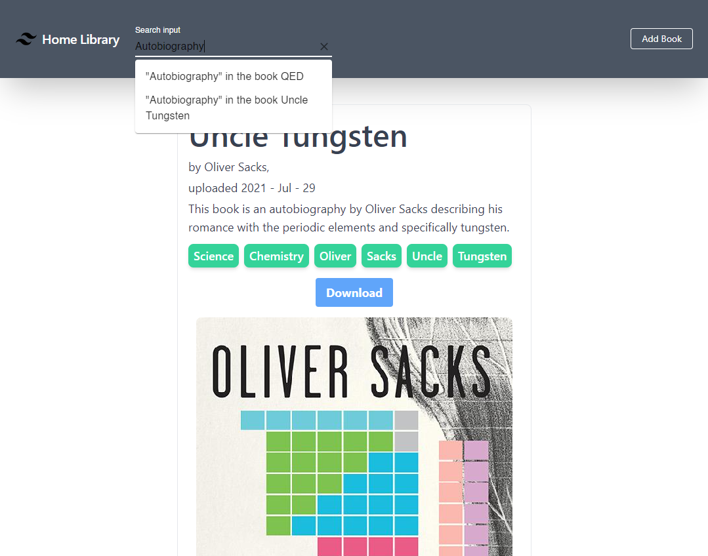

# Homelibrary

### Description

This project aims to simplify keeping a library of `.epub` files and searching them. When uploading a `.epub` file it automatically extracts the cover image. It also makes keywords, titles, author names and descriptions searchable using elasticsearch.

### Table of Content

- [**Getting Started**](#getting-started)
- [Built With](#built-with)

### Getting Started

To get started, build both the `src/front` service and the `src/back` service and customize the image names in the docker-compose files. Then Run `docker-compose -f docker-compose.prod.yml up` to start all necessary services. Any migrations will be automatically run on each startup of the `src/back` service. To run only the databases run `docker-compose -f docker-compose.dev.yml up`.
If you want to run the automated integration tests, run `docker-compose -f docker-compose.test.yml up`. I am using Jest and Supertest to check routes and cover extraction from the epubs.

### Usage

The main screen looks like this.

Upon clicking the `Add Book` button in the top-right corner, you will be taken to this page.

To view a book click on either the title or the cover.

There options to delete or edit the book will be shown to you.

To search for a book use the search bar in the top-left corner.

## Built With

This project was built using NodeJS and Express for the backend, NextJS and Tailwind for the frontend and Postgres and Elasticsearch to store the data. I use Jest and Supertest for testing.